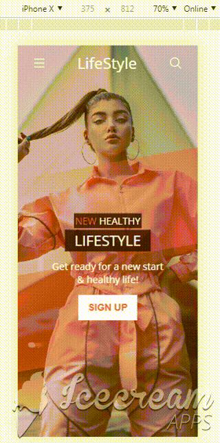

# Modern UI
Converting a home page design into HTML and CSS. This design is for a mobile version of the website. Converting a design is an essential part of Front-end development :)

## UI

## Demo

## What I learned ?
- Converting a design into HTML and CSS. 
- Gradient colors.
- Animations.
- Positioning elements.
- Using grid & flex layouts. 
- Applying Overlay.
- Control size of background image. 
- Using transform to change shape.

## Inspiration 
I was inspired by a 2-part series by Dansky YouTube channel. The series is [Mobile App UI Design in Adobe XD](https://www.youtube.com/watch?v=CnfXJ2qjv5I).

## Image source
[Photo by Ali Pazani on Unsplash](https://unsplash.com/photos/Qy59azZG5so)

 

